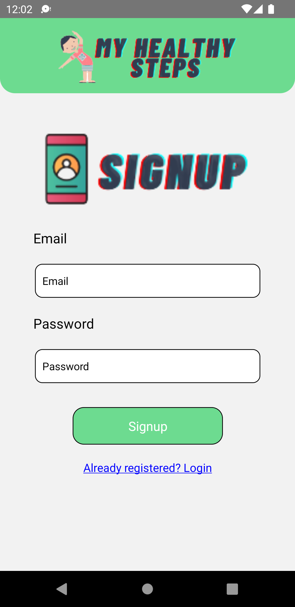
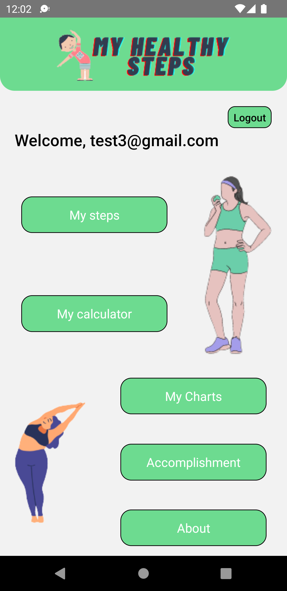
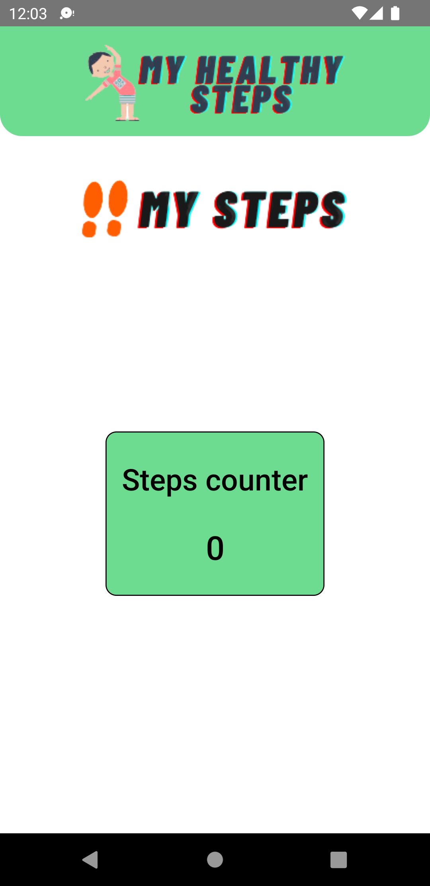
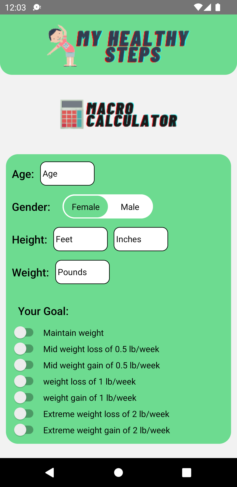

# myhealth
<h2>Initial Pages</h2>

<b>Authentication:</b> 
 
For the purpose of authentication we came up with the firebase so what is firebase? It is a google based platform that provides backend as a service. 
How does authentication work? 
After we created our project in firebase we used the authentication part of firebase and selected the email and password authentication. Firebase gives various important things to call such as  
<pre>
    <code>
apiKey: "##############", 
authDomain: "##############", 
projectId: "##############", 
storageBucket: "##############", 
messagingSenderId: "526787424668", 
appId: "##############", 
measurementId: "##############" 
    </code>
</pre>

Then we initialize the app suing the firebase function called initializeApp 
<pre>
    <code>
    if (!firebase.apps.length) { 
    app = firebase.initializeApp(firebaseConfig) 
    } else { 
    app = firebase.app(); 
    } 
    </code>
</pre>

Here we check if the app is already connected or not if it is connected then run the already present app else clear the new app. 
Basic pages consist of Login page and signup page and we added the splash screen using https://www.npmjs.com/package/react-native-splash-screen  

   
  
  
  
 

<h2>Addition feature Pages</h2> 

<b>Navigation:</b> 
For the purpose of Navigation we used stackNavigator and navigation container both of them are react native module  
<pre>
    <code>
import { createStackNavigator } from '@react-navigation/stack'; 
import { NavigationContainer } from '@react-navigation/native'; 
    </code>
</pre>

For the purpose of navigation we call all the component i.e all the screens using the function NavigationContainer we created stacks of all the screen  and able to navigate between this pages 
<pre>
    <code>
      <NavigationContainer>
       
    </code>
</pre>

Now we can use this name in the format of this.props.navigation.navigate(‘name of page') and we can do navigation to all the pages available in Stack.Navigator. 
<b>Step Counter:</b> 
For this problem we used the module named  
import { startCounter, stopCounter } from 'react-native-accurate-step-counter'; 

After learning about the module we came to know that it uses a sensor named the pedometer present inside the phone which calculates the movement based on that  movements we get the value of steps that we moved. 
<h3>Calculator</h3> 
<b>BMI Calculator:</b> 

In the BMI calculator, we took 3 inputs i.e Height (Feet and inches) and weight. Then we created the function named sum that calculates the BMI and gives the  condition if the user is underweight, overweight, Healthy or obese. 
Formula used = 703*(weight/height2 ) 
<pre>
    <code>
    let bmi=703*(weight/height2 ) 
    </code>
</pre>

<b>Macro Calculator:</b> 

In the macro calculator, we took 5 different inputs like age, gender, height(Feet & inchs) and  weight. In order to find the different parameters such as fat,  carbohydrates etc we need to find calories first by using the formula 
<pre>
    <code>
    protien = (calorie * 0.25) / 4  
    carbohydtae = (calorie * 0.5) / 4  
    fat = (calorie * 0.25) / 9  
    sugar = (calorie / 4) - 10  
    saturatedfat = (calorie / 4) - 5 
    </code>
</pre>
<b>Calorie Calculator:</b> 

For the calorie calculator, we used only require 4 parameters age, gender, height(feet, inches) and weight. 
Formula 
<pre>
    <code>
    maleColorie=weight + height - age - 161 
    femaleColorie=weight + height - age - 5 
    </code>
</pre>

  
  
  
 

